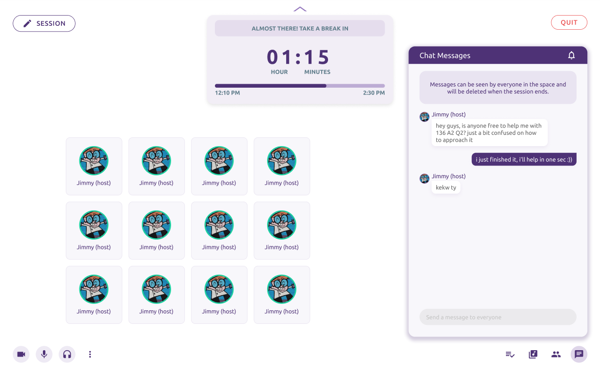

# About


Join other students in messaging, video, and voice chatting while being productive and studying!
# Getting Started 🚀🚀🚀

To start the frontend, simply run

```bash
npm i
npm run dev
```

Open [http://localhost:3000](http://localhost:3000) with your browser or see the [demo](https://www.loom.com/share/8c2a53ae39a44027a565096e1c4bc09e?t=5).
